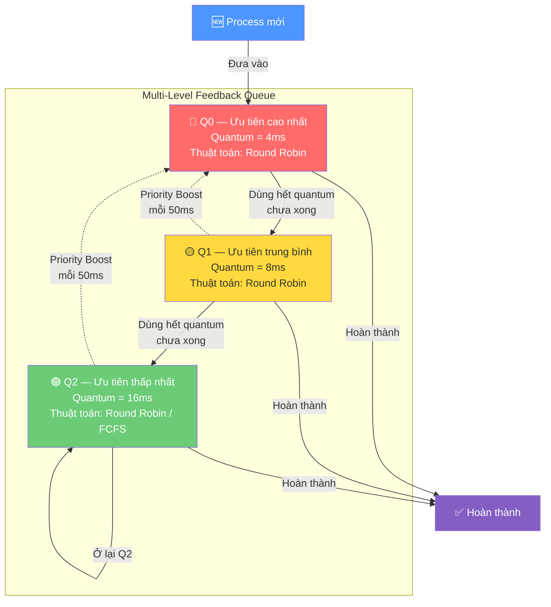
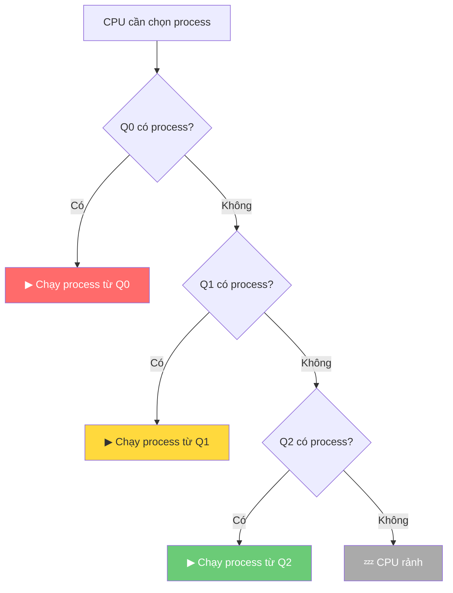
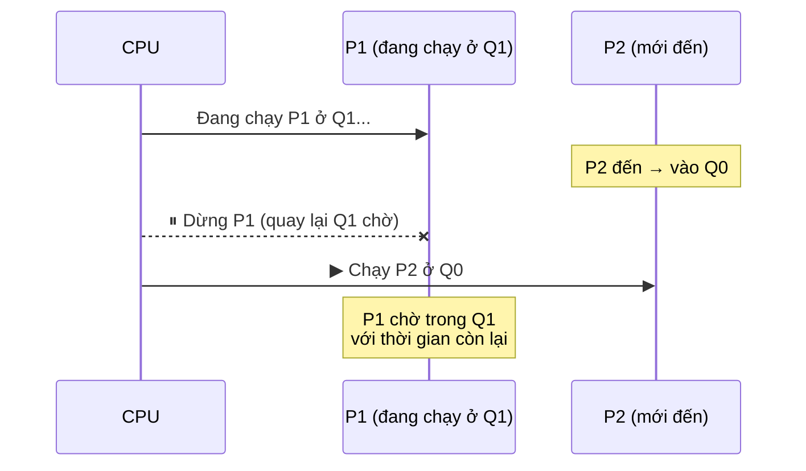
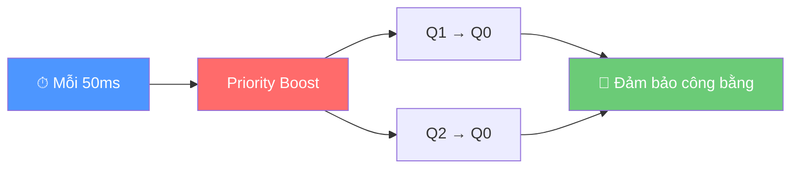

# Multi-Level Feedback Queue Scheduling

## 1. Thuật toán Multi-Level Feedback Queue (MLFQ) Scheduling

Hệ thống có nhiều hàng đợi, mỗi hàng đợi có một mức ưu tiên khác nhau:

- Tiến trình mới thường được đưa vào hàng đợi **ưu tiên cao**.
- Nếu tiến trình dùng CPU quá lâu, nó bị **hạ xuống** hàng đợi thấp hơn.
- Nếu tiến trình chờ quá lâu, nó có thể được **nâng ưu tiên** để tránh bị bỏ đói.

---

## 2. Quy tắc đưa process vào queue

Khi một process mới xuất hiện, nó được đưa vào **queue cao nhất** (Q0).

> **Ví dụ:** `P1` có `arrival = 0`, `burst = 20`

| Queue | Trạng thái ban đầu |
|-------|---------------------|
| Q0    | P1                  |
| Q1    | *(rỗng)*            |
| Q2    | *(rỗng)*            |

---

## 3. Quy tắc chọn process để chạy

CPU luôn kiểm tra từ queue ưu tiên **cao xuống thấp**:

1. Nếu **Q0** có process → chạy process trong Q0
2. Nếu Q0 rỗng và **Q1** có process → chạy process trong Q1
3. Nếu Q0, Q1 rỗng và **Q2** có process → chạy process trong Q2

> **Nghĩa là:**
> - CPU chỉ chạy Q1 khi Q0 rỗng.
> - CPU chỉ chạy Q2 khi Q0 và Q1 đều rỗng.

---

## 4. Quy tắc chạy trong từng queue

Trong mỗi queue, process được lấy theo thứ tự **FIFO** (First In, First Out):

- Process nào vào queue trước thì được chạy trước.
- Khi chạy, nó chỉ được chạy **tối đa bằng quantum** của queue đó.

> **Ví dụ:** Q0 có quantum = 4ms
> - P1 ở Q0 → chạy tối đa 4ms
> - Nếu P1 cần ≤ 4ms → P1 **hoàn thành**
> - Nếu P1 cần > 4ms → sau khi chạy hết 4ms, P1 bị **hạ xuống Q1**

---

## 5. Quy tắc hạ queue (Demotion)

Nếu một process **dùng hết quantum** của queue hiện tại mà vẫn chưa hoàn thành, nó bị hạ xuống queue thấp hơn:

| Tình huống | Kết quả |
|------------|---------|
| Chạy hết quantum Q0 mà chưa xong | → Xuống **Q1** |
| Chạy hết quantum Q1 mà chưa xong | → Xuống **Q2** |
| Chạy hết quantum Q2 mà chưa xong | → Ở lại **Q2** |

### Ví dụ: P1 có burst time = 20ms

| Quantum | Q0 = 4ms | Q1 = 8ms | Q2 = 16ms |
|---------|----------|----------|-----------|

| Thời gian | Queue | P1 chạy | Còn lại |
|-----------|-------|---------|---------|
| 0 → 4    | Q0    | 4ms     | 16ms    |
| 4 → 12   | Q1    | 8ms     | 8ms     |
| 12 → 20  | Q2    | 8ms     | 0ms ✅  |

> **P1 hoàn thành ở Q2.**

### Gantt Chart

```mermaid
gantt
    title Gantt Chart — Process P1 (burst = 20ms)
    dateFormat X
    axisFormat %s

    section Q0
    P1 (Q0, quantum=4ms) :active, 0, 4

    section Q1
    P1 (Q1, quantum=8ms) :active, 4, 12

    section Q2
    P1 (Q2, remaining=8ms) :active, 12, 20
```

---

## 6. Quy tắc khi có process mới đến

Process mới **luôn vào Q0**. Nếu CPU đang chạy process ở Q1 hoặc Q2 mà có process mới vào Q0, có 2 cách thiết kế:

### Cách 1: Preemptive MLFQ (có ngắt ưu tiên) ⭐ *Chuẩn hơn*

Vì Q0 có ưu tiên cao hơn, CPU **dừng** process hiện tại và chuyển sang chạy process mới.

### Cách 2: Non-preemptive (không ngắt giữa quantum) — *Dễ code hơn*

CPU cho process hiện tại **chạy hết quantum**, sau đó mới kiểm tra lại Q0.

> **Lưu ý:** Trong đồ án, nên nói rõ mình chọn cách nào. Nếu muốn đúng bản chất MLFQ hơn, nên chọn **Cách 1**.

---

## 7. Quy tắc chống đói — Aging / Priority Boost

Nếu process ở Q2 phải chờ quá lâu, nó có thể bị **đói** vì Q0 và Q1 cứ có process mới. Để tránh điều này, MLFQ thường có cơ chế **Priority Boost**.

### Cách hoạt động

**Ví dụ:**

| Cơ chế | Mô tả |
|--------|-------|
| **Boost định kỳ** | Cứ sau 50ms, đưa **tất cả** process chưa hoàn thành về Q0 |
| **Aging** | Nếu process chờ quá 30ms trong Q2, tăng nó lên Q1 |

> **Cách đơn giản cho đồ án:**
> Sau mỗi 50ms, toàn bộ process trong Q1 và Q2 được đưa về Q0.
>
> **Mục đích:** Không để process ở queue thấp phải chờ mãi.